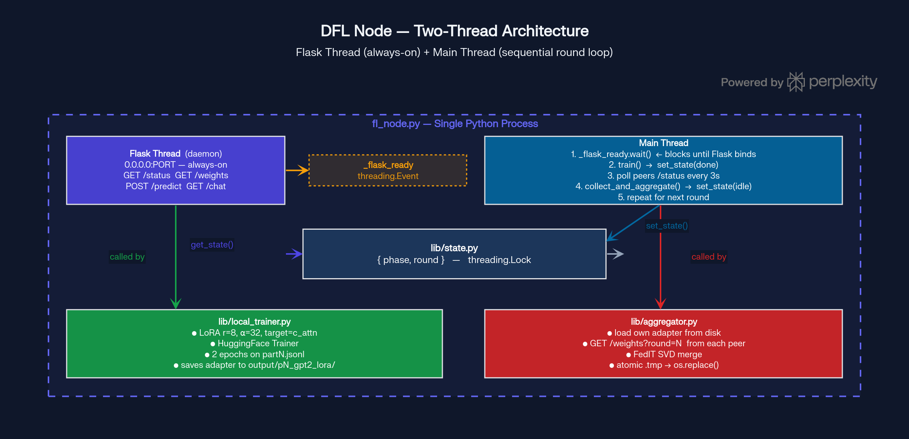
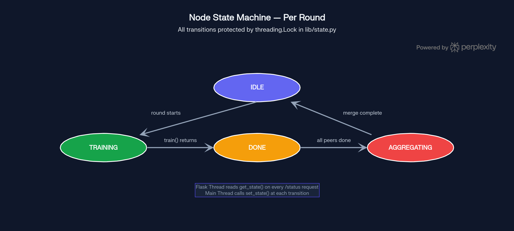
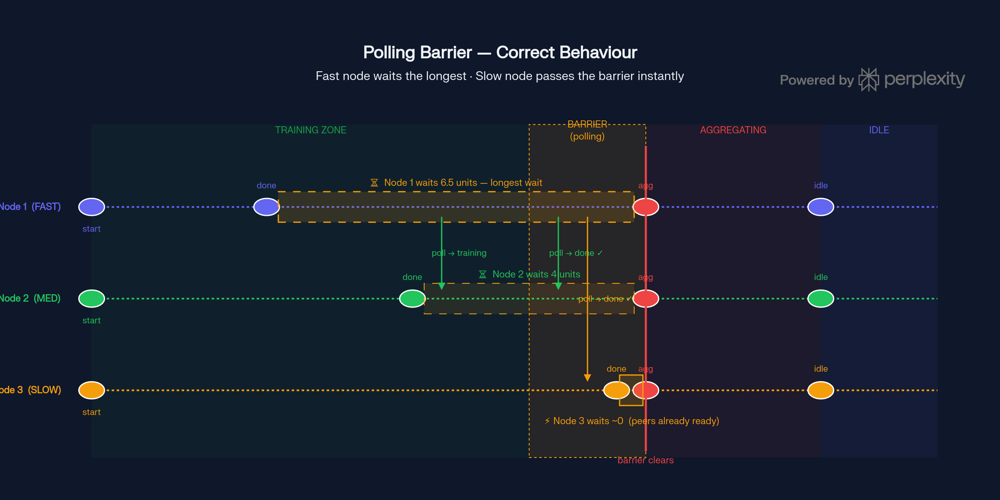
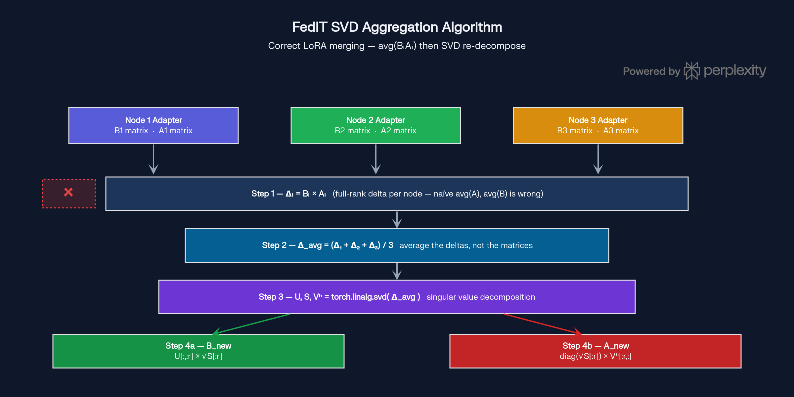

# DFL Clinic — Technical Report

## Decentralized Federated Learning for Medical Diagnosis

---

## 1. Introduction

This project implements a **Decentralized Federated Learning (DFL)** system
simulating three hospital nodes (Hospital A, B, C) that collaboratively
fine-tune a shared AI diagnostic model without any patient data ever leaving
a local institution.

The system is written entirely in Python, replacing a previous Java-based
coordination layer with Flask HTTP servers and Python's `threading` module.
There is no central coordinator — every node runs identical code and
communicates only over standard HTTP.

**Core privacy guarantee:** Raw patient data (`.jsonl` files) never leaves the
local node. Only trained LoRA adapter weights (floating-point matrices) are
transmitted between peers.

---

## 2. System Architecture

### 2.1 Overview

Each hospital runs a single `fl_node.py` Python process. The process has
exactly **two threads**:

| Thread | Role | Lifetime |
|---|---|---|
| Flask Thread (daemon) | Always-on HTTP server on `0.0.0.0:PORT` | Full process |
| Main Thread | Sequential: train → poll → aggregate → repeat | Full process |



The key insight is that training and aggregation are **sequential**, not
concurrent — a node always finishes training before it polls, and always
finishes polling before it aggregates. Only the Flask thread needs to be
genuinely concurrent, because it must respond to peer `/status` polls
*while* the main thread is busy training.

### 2.2 Startup Sequence

Flask must be fully bound before any ML work begins. The main thread blocks
on `_flask_ready.wait()` — a `threading.Event` set the moment `app.run()`
is called on the Flask thread. This means:

- `ConnectionRefusedError` from a peer **always** means crashed or offline,
  never "still starting"
- The cluster can reliably detect dead nodes vs. slow-booting nodes

### 2.3 Module Dependency Flow

```
fl_node.py
  ├── lib/state.py        ← get_state() for Flask /status route
  ├── lib/round_loop.py   ← run(cfg) — blocks until all rounds done
  ├── lib/inference.py    ← run_inference() for /predict route
  └── lib/local_trainer   ← globals patched at startup

lib/round_loop.py
  ├── lib/state.py        ← set_state(), get_state()
  ├── lib/local_trainer   ← train()
  ├── lib/aggregator      ← collect_and_aggregate()
  └── lib/inference       ← invalidate_cache()
```

No circular imports. Dependency flow is strictly top-down.

---

## 3. Shared State & Thread Safety

### 3.1 The State Object

`lib/state.py` contains exactly one dict and one lock:

```python
_lock  = threading.Lock()
_state = {"phase": "idle", "round": 0}
```

All reads go through `get_state()` which returns a **copy** of the dict.
All writes go through `set_state(phase, round_num)` which updates both
fields atomically under the lock.



### 3.2 The Four States (Node Lifecycle Table)

| Phase | Meaning | Node Activity | Exit Condition |
|---|---|---|---|
| **`training`** | Active ML operations | Fine-tuning the local base model with private JSONL data. | Local training step completes successfully. |
| **`done`** | The Polling Barrier | Sending `GET /status` to peers every 3 seconds, blocking execution. | All peers report `done` (or a future state), OR the 10-minute timeout is reached. |
| **`aggregating`** | Network & Merge | Fetching peer adapters via `/weights` and running the FedIT SVD algorithm. | SVD merge completes and the new adapter is atomically written to disk. |
| **`idle`** | Cleanup | Invalidating the inference cache for the `/predict` route. | Instantly loops back to `training` to begin the next round (if rounds remain). |

### 3.3 Why the Copy Matters

`get_state()` returns `dict(_state)` — a shallow copy, not a reference.
If it returned the live reference, Flask's `jsonify()` could be serializing
a dict that the main thread is mutating at the same time, even after the
lock is released. The copy makes the snapshot immutable from the caller's
perspective.

### 3.3 Why Both Fields Are Required

Returning only `phase` in `/status` would allow a subtle cross-round bug:

```
Node 1 finishes round 2, sets phase=done, round=2
Node 2 finishes round 1, polls Node 1 → sees phase=done
Node 2 thinks Node 1 is done for round 1 → wrong aggregation
```

By always returning `{"phase": "done", "round": 2}` and checking **both**
fields on the poller side, stale-round false positives are eliminated.

---

## 4. Communication — Who Sends What

Nodes communicate exclusively over HTTP. No raw TCP sockets, no message
queues, no shared memory between processes.

| Sender | Receiver | Request | When |
|---|---|---|---|
| Main thread | All peers | `GET /status` | Every 3s during polling barrier |
| Aggregation (main) | All peers | `GET /weights?round=N` | Once per round after barrier |
| External client | Any node | `POST /predict` | Any time post round 1 |
| Browser | Any node | `GET /chat` | Interactive testing |

The `/weights?round=N` guard is a second stale-data layer: even if a node
polls the right phase but wrong round, the weight download returns 404
rather than serving last round's adapter.

### 4.1 Atomic Adapter Write

After merging, the adapter is written via:

```python
save_file(merged, path + ".tmp")
os.replace(path + ".tmp", path)   # POSIX atomic rename
```

`os.replace()` is guaranteed atomic by the OS. A concurrent `GET /weights`
will always receive either the complete old adapter or the complete new one,
never a partial file mid-write.

---

## 5. The Polling Barrier & Race Condition Fix

Instead of a TCP barrier or a central sync server, nodes use a
**polling-based soft barrier** in `lib/round_loop.py`.



### 5.1 The Original Race Condition (Bug #1)

The original logic checked for exactly `{"phase": "done", "round": N}`.
This caused a deadlock because of the 3-second sleep interval during polling:

```text
Node 1 & 2 (fast): finish training, enter `done`, and start polling every 3s.
Node 3 (slow): finishes training, sets state to `done`.
Node 3 polls peers: sees Node 1 & 2 are already `done`. Node 3 instantly passes the barrier and enters `aggregating` or even Round 2.
Node 1 & 2 wake up from their 3s sleep and poll Node 3.
Node 1 & 2 see Node 3 is in `aggregating` (or Round 2).
Node 1 & 2 expected exactly `done` for Round 1 → they reject Node 3 and wait forever → deadlock.
```

The paradox was that the **slowest node was the one that raced ahead**, leaving the fast nodes trapped because they were caught sleeping when the slow node briefly flashed its "done" status.

### 5.2 The Fix — Accepting Future States

A peer is considered "ready for round N" if it is in any **equal or
forward** state:

```python
def _peer_is_ready(body: dict, round_num: int) -> bool:
    phase = body.get("phase")
    round = body.get("round", 0)
    if round > round_num:
        return True   # peer already moved to a future round
    if round == round_num and phase in ("done", "aggregating", "idle"):
        return True
    return False
```

If a peer has moved past `done` into `aggregating` or `idle`, it already
completed its training for round N — its weights are available on disk.

### 5.3 Fault Tolerance

- `ConnectionRefusedError` → log warning, retry on next interval
- Non-200 response → log warning, retry
- Peer exceeds `--poll-timeout` → logged, skipped for this round's
  aggregation, cluster continues rather than hanging forever

---

## 6. FedIT SVD Aggregation



### 6.1 Why Naive Averaging Is Mathematically Wrong

LoRA decomposes each weight update into two low-rank matrices:
ΔW = B × A. The actual learned delta is the **product**, not the
individual matrices. Averaging them separately breaks the algebra:

```
avg(Bᵢ) × avg(Aᵢ)  ≠  avg(Bᵢ × Aᵢ)
```

Naive averaging produces a merged adapter that does not represent the
mean of what any node actually learned.

### 6.2 The Correct Algorithm (FedIT)

For each LoRA layer, `lib/aggregator.py` does:

1. **Compute full delta per peer:** Δᵢ = Bᵢ × Aᵢ
2. **Average deltas:** Δ_avg = (1/N) Σ Δᵢ
3. **SVD decompose:** U, S, Vʰ = torch.linalg.svd(Δ_avg)
4. **Reconstruct B_new:** U[:,:r] × √S[:r]
5. **Reconstruct A_new:** diag(√S[:r]) × Vʰ[:r,:]

Non-LoRA parameters (biases etc.) use simple mean averaging.

### 6.3 Safetensors Requirements

All output tensors must be:
- Cast to `torch.float16` to match original adapter dtype
- Marked `.contiguous()` — SVD returns strided views which
  `save_file()` rejects without this

---

## 7. Inference & Prompt Engineering

### 7.1 Bug: Gibberish Output (Bug #3)

GPT-2 is a causal LM — it continues text starting from the exact prompt
format seen during training. The original inference code used:

```
Symptoms: {text}
Diagnosis:
```

But the training data used:

```
Question: {text}
Reasoning: {cot}
Answer: {response}
```

The mismatch produced blank or incoherent completions.

### 7.2 Fix

`lib/inference.py` mirrors the training prompt exactly:

```python
prompt = f"Question: {symptoms}\nReasoning:\nAnswer:"
```

Sampling was also improved: `do_sample=True, temperature=0.7,
max_new_tokens=150` produces coherent diagnostic reasoning rather than
repetitive greedy decoding.

### 7.3 Model Cache & Invalidation

The model is lazily loaded on the first `/predict` call and held in a
module-level `Optional[GPT2LMHeadModel]`. After every aggregation round,
`inference.invalidate_cache()` clears it — the next `/predict` call
loads the freshly merged adapter automatically.

---

## 8. Technology Stack

| Layer | Technology | Purpose |
|---|---|---|
| HTTP Server | Flask + Werkzeug | Endpoints per node, always-on |
| Concurrency | `threading.Thread`, `threading.Event`, `threading.Lock` | Thread coordination + state safety |
| Base Model | `distilbert/distilgpt2` | Causal LM backbone |
| Fine-Tuning | PEFT LoRA `r=8, α=32, target=c_attn` | Parameter-efficient adapters |
| Trainer | HuggingFace `Trainer` | Batching, gradient steps, saving |
| Weight Format | `safetensors` | Fast, safe binary tensor serialization |
| Aggregation | `torch.linalg.svd` | SVD re-decompose for FedIT |
| HTTP Client | `requests` | Peer polling + weight download |
| Atomic Write | `os.replace()` | Prevent partial file reads |
| Browser UI | Flask `render_template` + HTML/JS | Interactive `/chat` testing |

---

## 9. Problems Solved Summary

| # | Problem | Root Cause | Fix |
|---|---|---|---|
| 1 | Polling deadlock | Only `phase=done` accepted as ready | Accept `aggregating`, `idle`, future round |
| 2 | Boot race condition | Main thread polled before Flask bound | `_flask_ready.wait()` blocks until Flask binds |
| 3 | Gibberish inference | Prompt format mismatch train vs inference | Mirror exact training prompt in `inference.py` |

---

## 10. Privacy Model

Raw patient data (`.jsonl` files) never leaves the local node under any
code path. The only inter-node data transfer is:

- `GET /weights` — trained LoRA adapter (~few MB of float16 matrices)
- `GET /status` — tiny JSON `{"phase":"done","round":1}`

LoRA adapters encode learned statistical patterns across many patient
records. They do not contain or reconstruct individual records, which
is the fundamental privacy property of federated learning.
